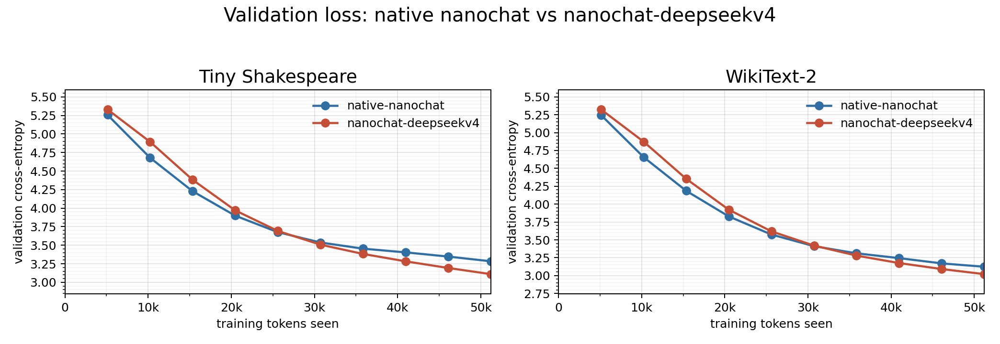
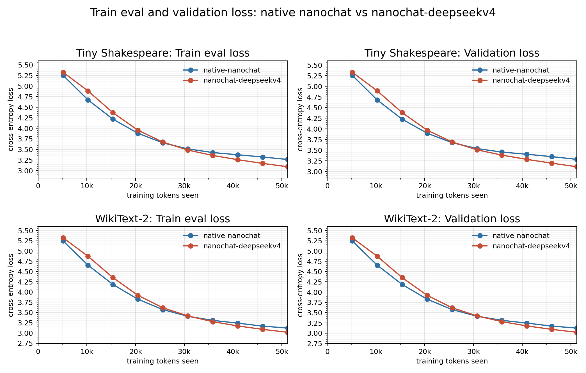
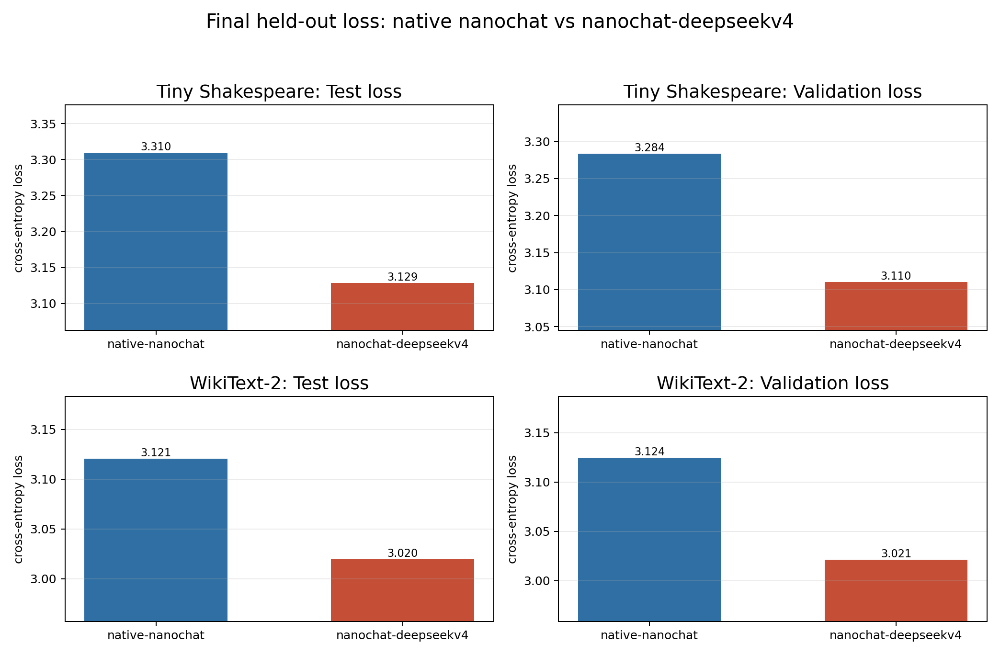

# nanochat-deepseekv4

This repository is a compact PyTorch experiment that ports practical
DeepSeek-V4 architecture ideas into a small nanochat-style language-model
benchmark. It keeps a tiny native GPT baseline only so the DeepSeek-V4 variant
can be compared under the same byte-level training loop.

It is not a DeepSeek checkpoint loader and it does not include DeepSeek's
production FP4/FP8 kernel stack.

## Attribution

This experiment is built from Andrej Karpathy's
[nanochat](https://github.com/karpathy/nanochat) codebase and keeps only a
small native GPT baseline for comparison. The DeepSeek-V4 variant is an
independent, small-scale PyTorch approximation of architecture ideas attributed
to DeepSeek, including the public
[DeepSeek-V4-Pro](https://huggingface.co/deepseek-ai/DeepSeek-V4-Pro) model
page and the feature list used for this experiment.

## What Is Implemented

The main model is [nanochat/deepseek_v4.py](nanochat/deepseek_v4.py).

Implemented or approximated:

- Transformer backbone
- DeepSeekMoE-style routed experts
- Fine-grained routed experts and one shared expert
- Hash routing in early layers
- Auxiliary-loss-free expert-bias load balancing
- Sequence-wise balance loss
- sqrt-softplus routing affinity
- SwiGLU experts with clamping
- Multi-token prediction with embedding and hidden projections
- RMSNorm throughout attention, MTP, and mHC paths
- Manifold-constrained Hyper-Connections with explicit `A_l`, `B_l`, and `C_l`
- Sinkhorn-projected doubly stochastic residual mapping
- Interleaved CSA/HCA hybrid attention layers
- Sliding-window KV branch
- KV compression into compressed entries
- Token-level compressor
- Lightning Indexer with compressed indexer keys, indexer queries, index scores,
  and top-k compressed KV selection
- Shared-KV MQA in the benchmark configuration
- Low-rank query projection
- Grouped low-rank output projection
- Query/KV-entry RMSNorm
- Partial RoPE
- Attention sink

Not implemented:

- DeepSeek FP4/MXFP4/FP8 training and serving stack
- DeepGEMM, TileLang, MegaMoE, host codegen, or deterministic decode kernels
- Context parallelism, expert parallelism, or communication-overlap runtime
- On-disk KV cache and production heterogeneous inference cache system
- 1M-token native context validation

## Benchmark

The benchmark script is [scripts/compare_deepseekv4.py](scripts/compare_deepseekv4.py).

The recorded run uses the full Tiny Shakespeare text and full WikiText-2
raw-v1 train/validation/test splits. Training samples random byte windows from
the full train split for 100 optimizer steps; the optimizer sees 51,200 byte
tokens, not a full epoch. Validation and test losses are computed over every
non-overlapping 64-byte window in the full validation/test splits.

The comparison uses pure next-token cross-entropy for train-eval, validation,
and test. The DeepSeek-V4 training objective still includes MTP and balancing
terms internally, but those auxiliary terms are not used for the reported
curves. Test loss is reported as a final held-out number rather than as a curve.

Settings:

- byte-level tokens, vocabulary size 257
- sequence length 64
- batch size 8
- training tokens seen: 51,200
- 2 layers
- embedding width 128
- 4 attention heads
- 100 optimizer steps
- full validation/test evaluation every 10 steps
- test is shown as final held-out metrics, not as a curve
- full-eval batch size 256
- train-eval sample: 8,192 fixed train windows, 524,288 byte tokens
- AdamW, learning rate `3e-4`, weight decay `0.01`, grad clip `1.0`
- device used for the recorded run: Apple MPS

The plotted points are evaluations at steps `10, 20, ..., 100`; the x-axis is
training tokens seen.

Dataset sizes:

Because this benchmark is byte-level, one token is one UTF-8 byte. Sizes are
decimal MB.

| dataset | split | characters | byte tokens | size |
|---|---:|---:|---:|---:|
| Tiny Shakespeare | train | 1,003,854 | 1,003,854 | 1.00 MB |
| Tiny Shakespeare | validation | 55,770 | 55,770 | 0.06 MB |
| Tiny Shakespeare | test | 55,770 | 55,770 | 0.06 MB |
| Tiny Shakespeare | total | 1,115,394 | 1,115,394 | 1.12 MB |
| WikiText-2 | train | 10,916,756 | 10,938,611 | 10.94 MB |
| WikiText-2 | validation | 1,144,610 | 1,146,708 | 1.15 MB |
| WikiText-2 | test | 1,288,512 | 1,290,546 | 1.29 MB |
| WikiText-2 | total | 13,349,878 | 13,375,865 | 13.38 MB |

Model sizes:

Active parameters estimate the parameters used on a single token path. For the
MoE model this counts the selected experts and excludes inactive routed experts
and MTP-only prediction heads.

| model | total parameters | active parameters/token |
|---|---:|---:|
| native-nanochat | 475,136 | 475,136 |
| nanochat-deepseekv4 | 778,160 | 507,824 |

Primary validation curves:



Train-eval and validation curves:

The train-eval panel uses the same fixed train windows for both models at every
checkpoint. This is a held-aside diagnostic sample from the train split, not the
last optimizer minibatch.



Final validation/test metrics:



| dataset | model | split | tokens trained | loss | perplexity | bits/byte | total params | active params |
|---|---|---|---:|---:|---:|---:|---:|---:|
| Tiny Shakespeare | native-nanochat | train eval | 51,200 | 3.2635 | 26.14 | 4.708 | 475,136 | 475,136 |
| Tiny Shakespeare | native-nanochat | validation | 51,200 | 3.2837 | 26.67 | 4.737 | 475,136 | 475,136 |
| Tiny Shakespeare | native-nanochat | test | 51,200 | 3.3095 | 27.37 | 4.775 | 475,136 | 475,136 |
| Tiny Shakespeare | nanochat-deepseekv4 | train eval | 51,200 | 3.0912 | 22.00 | 4.460 | 778,160 | 507,824 |
| Tiny Shakespeare | nanochat-deepseekv4 | validation | 51,200 | 3.1104 | 22.43 | 4.487 | 778,160 | 507,824 |
| Tiny Shakespeare | nanochat-deepseekv4 | test | 51,200 | 3.1286 | 22.84 | 4.514 | 778,160 | 507,824 |
| WikiText-2 | native-nanochat | train eval | 51,200 | 3.1208 | 22.66 | 4.502 | 475,136 | 475,136 |
| WikiText-2 | native-nanochat | validation | 51,200 | 3.1243 | 22.74 | 4.507 | 475,136 | 475,136 |
| WikiText-2 | native-nanochat | test | 51,200 | 3.1207 | 22.66 | 4.502 | 475,136 | 475,136 |
| WikiText-2 | nanochat-deepseekv4 | train eval | 51,200 | 3.0175 | 20.44 | 4.353 | 778,160 | 507,824 |
| WikiText-2 | nanochat-deepseekv4 | validation | 51,200 | 3.0211 | 20.51 | 4.358 | 778,160 | 507,824 |
| WikiText-2 | nanochat-deepseekv4 | test | 51,200 | 3.0195 | 20.48 | 4.356 | 778,160 | 507,824 |

What the curves show:

Both models are trained from scratch for only 100 steps, so this is a small
architecture smoke test, not a claim about production DeepSeek-scale training.
Within that short budget, the DeepSeek-V4 variant starts slower, catches the
native baseline around the middle of training, and finishes lower on
train-eval, validation, and test for both datasets.

Final held-out improvement:

| dataset | split | native loss | deepseekv4 loss | loss delta | native PPL | deepseekv4 PPL | PPL reduction |
|---|---|---:|---:|---:|---:|---:|---:|
| Tiny Shakespeare | validation | 3.2837 | 3.1104 | -0.1732 | 26.67 | 22.43 | 15.9% |
| Tiny Shakespeare | test | 3.3095 | 3.1286 | -0.1809 | 27.37 | 22.84 | 16.5% |
| WikiText-2 | validation | 3.1243 | 3.0211 | -0.1033 | 22.74 | 20.51 | 9.8% |
| WikiText-2 | test | 3.1207 | 3.0195 | -0.1012 | 22.66 | 20.48 | 9.6% |

Learning dynamics:

- The native baseline improves faster at the start. It is simpler and easier to
  optimize from scratch.
- The DeepSeek-V4 variant has more moving parts to coordinate: MoE routing,
  mHC residual mixing, compressed attention, and MTP.
- On Tiny Shakespeare, nanochat-deepseekv4 crosses the native validation curve
  between steps 50 and 60.
- On WikiText-2, nanochat-deepseekv4 crosses the native validation curve
  between steps 60 and 70.
- After crossover, the gap keeps widening through step 100.
- Train-eval, validation, and test losses remain close to each other. In this
  run, the improvement is not just a validation-only artifact.

The Tiny Shakespeare and WikiText-2 curves have similar shapes because this is
a byte-level benchmark with a short sequence length and very short training
run. Early learning is dominated by local byte and character statistics, so the
first 100 steps look more alike than they would in a longer tokenized-language
training run.

The comparison is not parameter matched. The native baseline has `475,136`
total parameters; nanochat-deepseekv4 has `778,160` total and about `507,824`
active parameters per token. Treat the result as a practical feature-port
comparison under the same training loop, not a pure parameter-efficiency
ablation.

Raw results are in
[artifacts/deepseekv4_full_curve/losses.csv](artifacts/deepseekv4_full_curve/losses.csv)
and
[artifacts/deepseekv4_full_curve/summary.csv](artifacts/deepseekv4_full_curve/summary.csv).

## Reproduce

Install the small dependency set:

```bash
python -m pip install torch matplotlib pyarrow pytest
```

Run tests:

```bash
python -m pytest tests/test_deepseek_v4.py -q
```

Run the full-data comparison:

```bash
python -m scripts.compare_deepseekv4 \
  --datasets tiny_shakespeare,wikitext2 \
  --full-data \
  --full-eval \
  --skip-initial-eval \
  --steps 100 \
  --eval-every 10 \
  --batch-size 8 \
  --eval-batch-size 256 \
  --train-eval-batches 32 \
  --seq-len 64 \
  --n-layer 2 \
  --n-embd 128 \
  --n-head 4 \
  --device mps \
  --output-dir artifacts/deepseekv4_full_curve
```

Use `--device cpu`, `--device cuda`, or omit the flag for autodetection.
Downloaded dataset caches are written under `data_cache/` inside the output
directory and are ignored by git.

## License

This repository is MIT licensed. The code is derived from Andrej Karpathy's
MIT-licensed nanochat codebase, and the upstream copyright notice is preserved
in [LICENSE](LICENSE). The DeepSeek-V4 code here is an independent small-scale
implementation of public architecture ideas; this repository does not
redistribute DeepSeek weights, tokenizer artifacts, generated model files, or
original DeepSeek source code. See [NOTICE.md](NOTICE.md) for the full notice.
