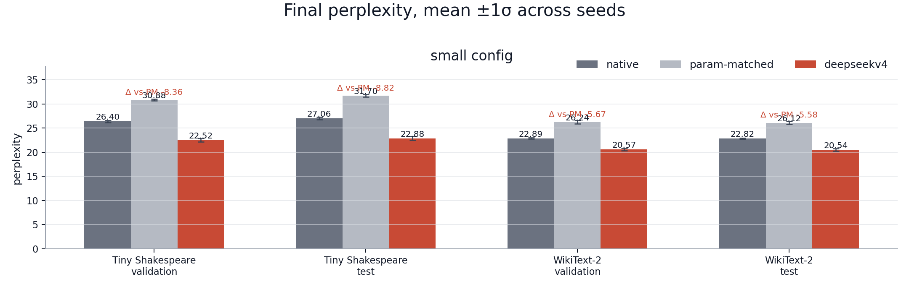
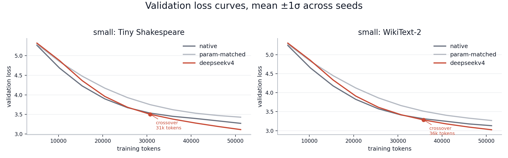
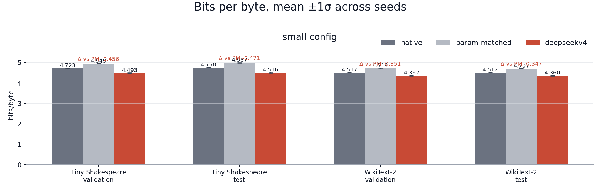
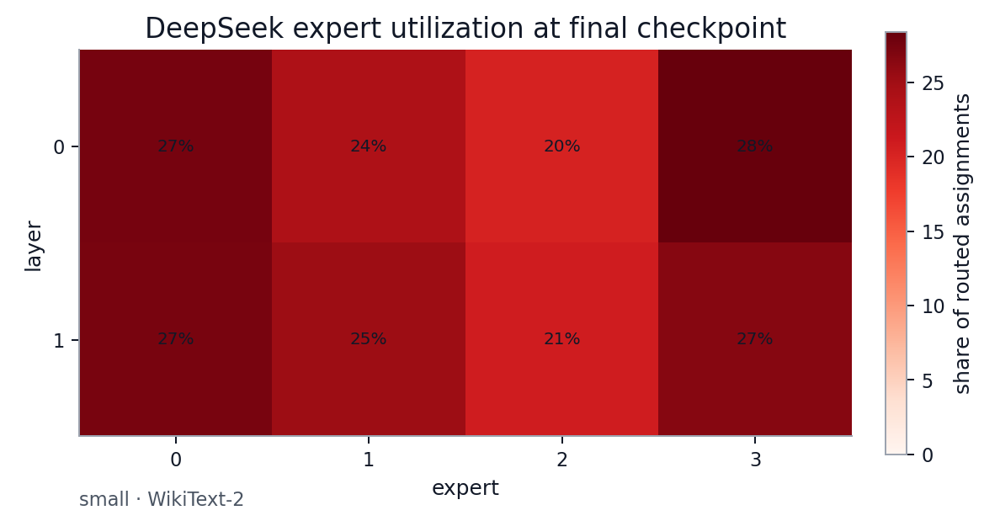
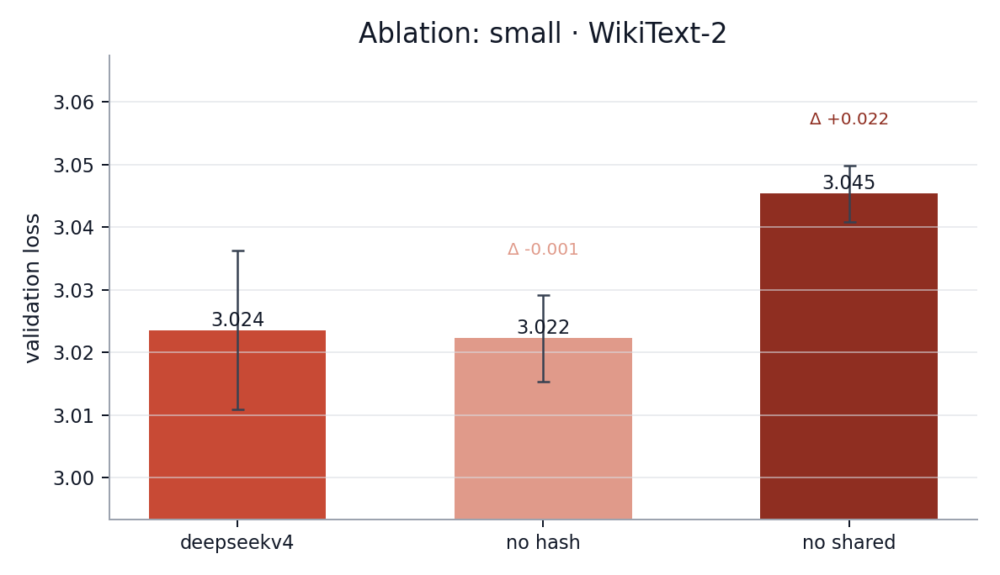

# nanochat-deepseekv4

This repository is a compact PyTorch experiment that ports selected
DeepSeek-V4 architecture ideas into a small nanochat-style language-model
benchmark. The goal is measurement, not advocacy: compare a native GPT
baseline, an active-parameter-matched GPT baseline, and a DeepSeek-V4-style
variant under the same byte-level training loop.

It is not a DeepSeek checkpoint loader, does not redistribute DeepSeek weights,
and does not include DeepSeek's production FP4/FP8 kernel stack.

## Attribution

This experiment is built from Andrej Karpathy's
[nanochat](https://github.com/karpathy/nanochat) codebase and keeps a small
native GPT baseline for comparison. The DeepSeek-V4 implementation is an
independent, small-scale PyTorch approximation of public architecture ideas
attributed to DeepSeek, including the public
[DeepSeek-V4-Pro](https://huggingface.co/deepseek-ai/DeepSeek-V4-Pro) model
page and the feature list used for this experiment.

## Implemented DeepSeek-V4 Ideas

The main implementation is in [nanochat/deepseek_v4.py](nanochat/deepseek_v4.py).

Implemented or approximated:

- Transformer backbone with RMSNorm and SwiGLU blocks.
- DeepSeekMoE-style routed experts, fine-grained routed experts, and one shared
  expert.
- Deterministic fixed-permutation hash routing in the early fraction of layers.
- Expert-bias balancing with a light sequence-wise auxiliary balance loss.
- sqrt-softplus routing affinity.
- Multi-token prediction heads with embedding and hidden projections.
- Manifold-constrained Hyper-Connections with explicit input, residual, and
  output mappings.
- Sinkhorn-projected doubly stochastic residual mixing.
- Interleaved compressed sparse attention and heavily compressed attention.
- Sliding-window KV branch.
- Token-level KV compression, compressed KV entries, Lightning Indexer queries,
  compressed indexer keys, index scores, and top-k compressed KV selection.
- Shared-KV multi-query attention in the benchmark configuration.
- Low-rank query projection and grouped low-rank output projection.
- Query and KV-entry RMSNorm.
- Partial RoPE with a capped rotary cache.
- Explicit attention sink.

Clarification on naming: this repository no longer describes the whole MoE
objective as purely "aux-loss-free." The routed expert bias update is
auxiliary-loss-free, but the training objective also includes a small
sequence-wise balance auxiliary term.

Not implemented:

- DeepSeek FP4/MXFP4/FP8 training and serving.
- DeepGEMM, TileLang, MegaMoE, host codegen, or deterministic decode kernels.
- Context parallelism, expert parallelism, or communication-overlap runtime.
- On-disk KV cache and production heterogeneous inference cache system.
- 1M-token native context validation.

## Benchmark Status

The current committed measurements are seed-averaged small-config results:
3 seeds, 100 optimizer steps, full-data final evaluation, and full validation
curves. These are useful smoke-test results, not validation of DeepSeek-V4 at
scale.

The medium preset is implemented and is the right setting for a more meaningful
architecture test, because `seq_len=256` gives the compressed attention and
sliding-window branches room to operate. Medium results are not committed yet,
so this README makes no medium-quality claim.

Final train, validation, and test metrics are evaluated on every
non-overlapping byte window in the corresponding split. Training samples random
byte windows from the full train split; for the small run each model sees
51,200 training byte tokens, not a full epoch.

The benchmark script is [scripts/compare_deepseekv4.py](scripts/compare_deepseekv4.py).
Figures are rendered by [scripts/plot_deepseekv4_results.py](scripts/plot_deepseekv4_results.py).

## Configurations

| config | sequence length | layers | width | heads | batch | steps | checkpoint interval | status |
|---|---:|---:|---:|---:|---:|---:|---:|---|
| small | 64 | 2 | 128 | 4 | 8 | 100 | 10 steps | committed, 3 seeds |
| medium | 256 | 6 | 256 | 8 | 8 | 1,000 | 100 steps | runnable, not yet reported |

Model sizes for the benchmark presets:

| config | model | layers | width | total params | active params/token |
|---|---|---:|---:|---:|---:|
| small | native GPT | 2 | 128 | 475,136 | 475,136 |
| small | param-matched GPT | 4 | 96 | 503,808 | 503,808 |
| small | DeepSeek-V4 variant | 2 | 128 | 778,160 | 507,824 |
| medium | native GPT | 6 | 256 | 4,882,432 | 4,882,432 |
| medium | param-matched GPT | 6 | 256 | 4,882,432 | 4,882,432 |
| medium | DeepSeek-V4 variant | 6 | 256 | 12,242,456 | 4,951,576 |

For the medium preset, the native GPT and parameter-matched GPT resolve to the
same architecture because the native preset is already within about 1.4% of the
DeepSeek variant's active parameters per token.

Runtime guidance:

| device | small full run | medium full run |
|---|---|---|
| Apple MPS | supported; practical for the committed small run | supported, but likely overnight or longer |
| CUDA | expected to be the best target | recommended for the 3-seed, 1,000-step run |
| CPU | smoke tests only | not recommended |

CUDA runtime has not been measured in this repository yet; treat the table as
planning guidance, not a benchmark.

## Dataset Sizes

This is a byte-level benchmark, so one token is one UTF-8 byte. Sizes are
decimal MB.

| dataset | split | characters | byte tokens | size |
|---|---:|---:|---:|---:|
| Tiny Shakespeare | train | 1,003,854 | 1,003,854 | 1.00 MB |
| Tiny Shakespeare | validation | 55,770 | 55,770 | 0.06 MB |
| Tiny Shakespeare | test | 55,770 | 55,770 | 0.06 MB |
| Tiny Shakespeare | total | 1,115,394 | 1,115,394 | 1.12 MB |
| WikiText-2 | train | 10,916,756 | 10,938,611 | 10.94 MB |
| WikiText-2 | validation | 1,144,610 | 1,146,708 | 1.15 MB |
| WikiText-2 | test | 1,288,512 | 1,290,546 | 1.29 MB |
| WikiText-2 | total | 13,349,878 | 13,375,865 | 13.38 MB |

## Small-Config Results

All numbers are mean +/- sample standard deviation across 3 seeds.

| config | dataset | split | model | loss | perplexity | bits/byte |
|---|---|---|---|---:|---:|---:|
| small | Tiny Shakespeare | train | native GPT | 3.2547 +/- 0.0098 | 25.91 +/- 0.25 | 4.696 +/- 0.014 |
| small | Tiny Shakespeare | train | param-matched GPT | 3.4062 +/- 0.0051 | 30.15 +/- 0.15 | 4.914 +/- 0.007 |
| small | Tiny Shakespeare | train | DeepSeek-V4 variant | 3.0991 +/- 0.0181 | 22.18 +/- 0.40 | 4.471 +/- 0.026 |
| small | Tiny Shakespeare | validation | native GPT | 3.2734 +/- 0.0090 | 26.40 +/- 0.24 | 4.723 +/- 0.013 |
| small | Tiny Shakespeare | validation | param-matched GPT | 3.4302 +/- 0.0060 | 30.88 +/- 0.19 | 4.949 +/- 0.009 |
| small | Tiny Shakespeare | validation | DeepSeek-V4 variant | 3.1144 +/- 0.0165 | 22.52 +/- 0.37 | 4.493 +/- 0.024 |
| small | Tiny Shakespeare | test | native GPT | 3.2980 +/- 0.0100 | 27.06 +/- 0.27 | 4.758 +/- 0.014 |
| small | Tiny Shakespeare | test | param-matched GPT | 3.4564 +/- 0.0077 | 31.70 +/- 0.24 | 4.987 +/- 0.011 |
| small | Tiny Shakespeare | test | DeepSeek-V4 variant | 3.1303 +/- 0.0178 | 22.88 +/- 0.41 | 4.516 +/- 0.026 |
| small | WikiText-2 | train | native GPT | 3.1249 +/- 0.0074 | 22.76 +/- 0.17 | 4.508 +/- 0.011 |
| small | WikiText-2 | train | param-matched GPT | 3.2603 +/- 0.0118 | 26.06 +/- 0.31 | 4.704 +/- 0.017 |
| small | WikiText-2 | train | DeepSeek-V4 variant | 3.0183 +/- 0.0125 | 20.46 +/- 0.26 | 4.354 +/- 0.018 |
| small | WikiText-2 | validation | native GPT | 3.1308 +/- 0.0071 | 22.89 +/- 0.16 | 4.517 +/- 0.010 |
| small | WikiText-2 | validation | param-matched GPT | 3.2672 +/- 0.0126 | 26.24 +/- 0.33 | 4.714 +/- 0.018 |
| small | WikiText-2 | validation | DeepSeek-V4 variant | 3.0236 +/- 0.0127 | 20.57 +/- 0.26 | 4.362 +/- 0.018 |
| small | WikiText-2 | test | native GPT | 3.1275 +/- 0.0074 | 22.82 +/- 0.17 | 4.512 +/- 0.011 |
| small | WikiText-2 | test | param-matched GPT | 3.2626 +/- 0.0120 | 26.12 +/- 0.31 | 4.707 +/- 0.017 |
| small | WikiText-2 | test | DeepSeek-V4 variant | 3.0222 +/- 0.0126 | 20.54 +/- 0.26 | 4.360 +/- 0.018 |

Validation/test deltas for the DeepSeek-V4 variant:

| dataset | split | loss delta vs native | loss delta vs param-matched | PPL change vs native | PPL change vs param-matched |
|---|---|---:|---:|---:|---:|
| Tiny Shakespeare | validation | -0.1591 | -0.3159 | -14.7% | -27.1% |
| Tiny Shakespeare | test | -0.1678 | -0.3261 | -15.4% | -27.8% |
| WikiText-2 | validation | -0.1071 | -0.2435 | -10.2% | -21.6% |
| WikiText-2 | test | -0.1052 | -0.2404 | -10.0% | -21.4% |

Raw CSVs are in [artifacts/deepseekv4_small_multiseed](artifacts/deepseekv4_small_multiseed).

## Figures

Final perplexity:



Validation loss curves:



Bits/byte:



Expert utilization at the final DeepSeek-V4 checkpoint:



Ablations on WikiText-2 validation:



## Interpretation

In the committed small run, the DeepSeek-V4 variant finishes below both GPT
baselines on train, validation, and test for Tiny Shakespeare and WikiText-2.
That means the result is not just a validation-only artifact. It also means the
gain is not explained by active parameter count alone in this particular small
setting, because the parameter-matched GPT baseline is worse than both the
native GPT and the DeepSeek-style model.

The validation curves show the native GPT improving faster early in training,
while the DeepSeek-V4 variant catches up and crosses it later. That pattern is
plausible for a model with routing, compressed attention, Hyper-Connections,
and MTP: there are more mechanisms to coordinate, so the first few checkpoints
are not the whole story.

The ablation panel is mixed, which is exactly the kind of signal this benchmark
is meant to expose. Removing hash routing is statistically tied with the full
small model on WikiText-2 validation (`-0.0013` loss delta), so this run does
not support a small-scale hash-routing benefit. Removing the shared expert is
worse (`+0.0218` validation loss), which suggests the shared expert is earning
its parameters at this scale.

The expert-utilization heatmap shows no collapsed routed expert at the final
checkpoint. With top-2 routing across four experts, a perfectly even layer would
put about one quarter of assignments on each expert; the observed final
utilization stays near that range. That is evidence that the balancing machinery
is active, not evidence that the MoE design is optimal.

The main caveat is scale. At `seq_len=64`, compressed attention and
sliding-window behavior are still only lightly exercised. The medium preset is
the minimum configuration here that should be treated as a real architecture
test.

More detail is in [RESULTS.md](RESULTS.md).

## Reproduce

Install dependencies:

```bash
python -m pip install torch matplotlib pyarrow pytest
```

Run tests:

```bash
python -m pytest tests/test_deepseek_v4.py -q
```

Run the committed small benchmark:

```bash
python -m scripts.compare_deepseekv4 \
  --datasets tiny_shakespeare,wikitext2 \
  --config small \
  --models native,param_matched,deepseekv4 \
  --ablations full,no_hash,no_shared \
  --seeds 3 \
  --full-data \
  --full-eval \
  --skip-initial-eval \
  --device mps \
  --output-dir artifacts/deepseekv4_small_multiseed
```

Regenerate figures:

```bash
python -m scripts.plot_deepseekv4_results \
  --input-dir artifacts/deepseekv4_small_multiseed \
  --config small \
  --dataset wikitext2 \
  --ablation-split validation
```

Run the medium benchmark on CUDA:

```bash
python -m scripts.compare_deepseekv4 \
  --datasets tiny_shakespeare,wikitext2 \
  --config medium \
  --models native,param_matched,deepseekv4 \
  --seeds 3 \
  --full-data \
  --full-eval \
  --skip-initial-eval \
  --device cuda \
  --output-dir artifacts/deepseekv4_medium_multiseed
```

Downloaded dataset caches are written under `data_cache/` inside the output
directory and are ignored by git.

## License

This repository is MIT licensed. The code is derived from Andrej Karpathy's
MIT-licensed nanochat codebase, and the upstream copyright notice is preserved
in [LICENSE](LICENSE). The DeepSeek-V4 code here is an independent small-scale
implementation of public architecture ideas; this repository does not
redistribute DeepSeek weights, tokenizer artifacts, generated model files, or
original DeepSeek source code. See [NOTICE.md](NOTICE.md) for the full notice.
